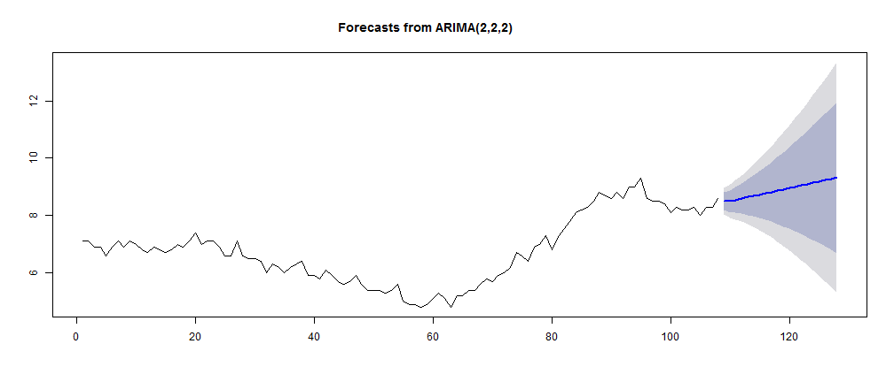

## Background and Data Source

- Background

This app is an application for the course project for Coursera online course Developing Data Products, which is the ninth course of the Data Science Specialization. 

- Data source

The data set is US economic time series from ggplot2 package. This dataset was produced from US economic time series data available from http://research.stlouisfed.org/fred2. It is a data frame with 478 rows and 6 variables, where each variable has the meaning as:

- date. Month of data collection
- psavert, personal savings rate
- pce, personal consumption expenditures, in billions of dollars
- unemploy, number of unemployed in thousands
- uempmed, median duration of unemployment, in week
- pop, total population, in thousands

--- .class #id 

## Model, target and jump start

- Target and model  
By using this app, you can have a clear view of the trend of the selected variable through years.
The prediction model used is ARIMA, whose parameters would be defined automatically by auto.arima function of R.

- Jump start  
On opening the app, you can find there are three input area. 
1) Select group to view
This is the list where you can select the forecast object.

2) Select the range of base year
In this slider, you can slide to alter the range of the years as base data for predition.

3) Select predict periods
This slider is set to alter the estimate period.

You can find the result real-time on the forecast image on the left hand.

---

## Sample Results

When selected "Median Duration of Unemployment", set base year between 1984 and 1994 and predit period at 20, you will get following result plot:

 

---

## Acknowledgement and Limitation of the Model

- Acknowlegement
The model is designed by Steven for Coursera course project and hosted by Shinyapps.io.

- Limitation of the model
The parameterers of the model is automatically defined based on data filtered(function auto.arima), thus it might not always give a best prediction on when specific requirements exist.

